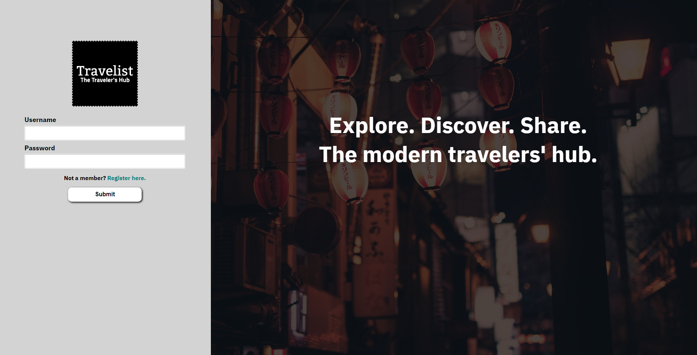
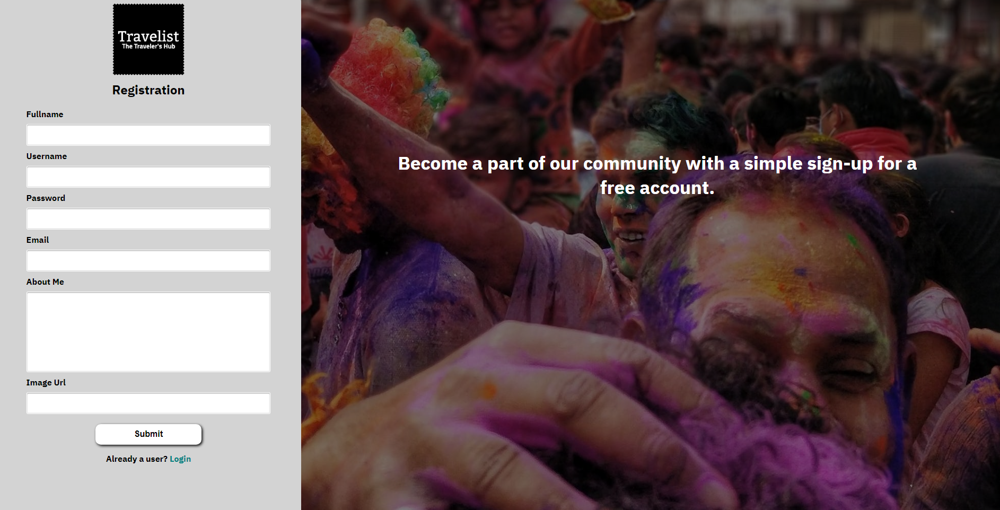
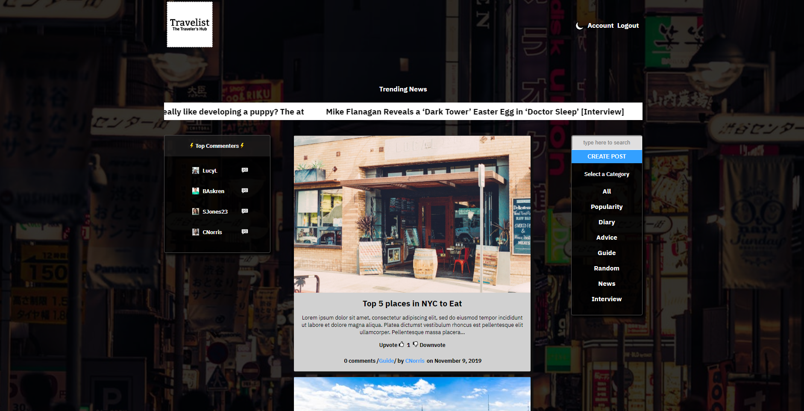
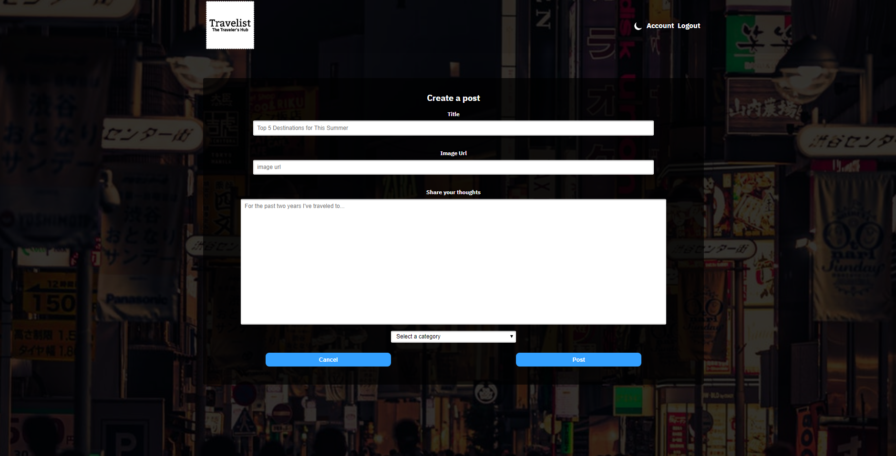
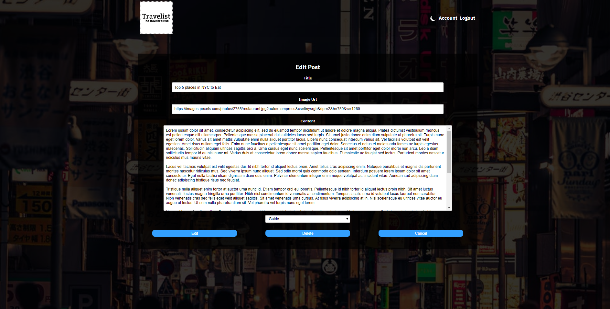
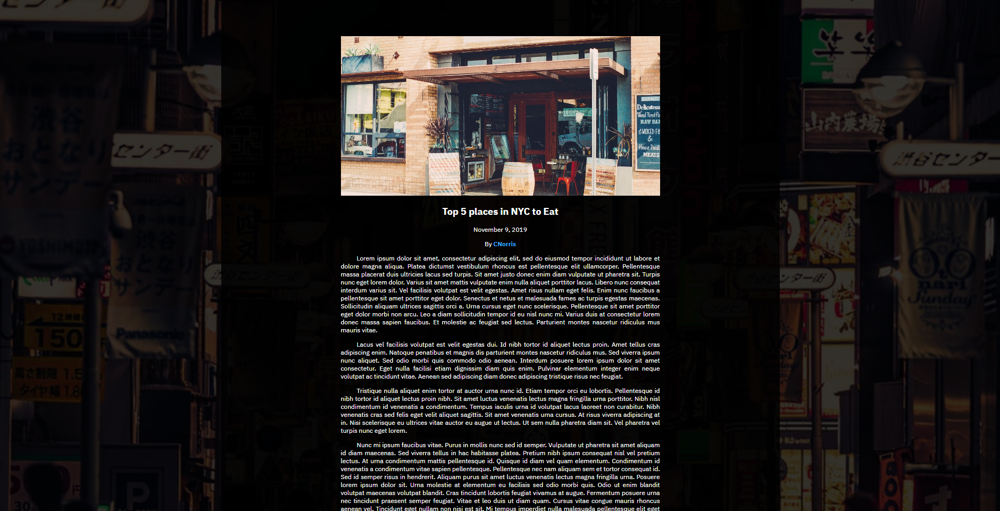
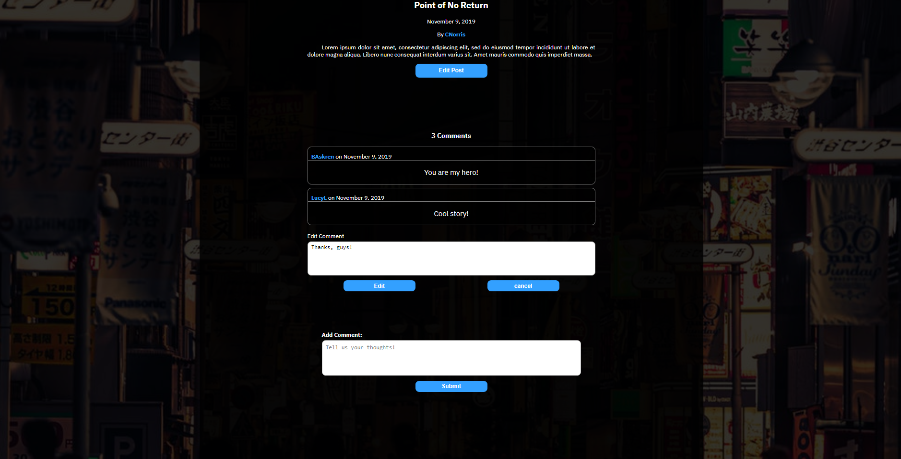
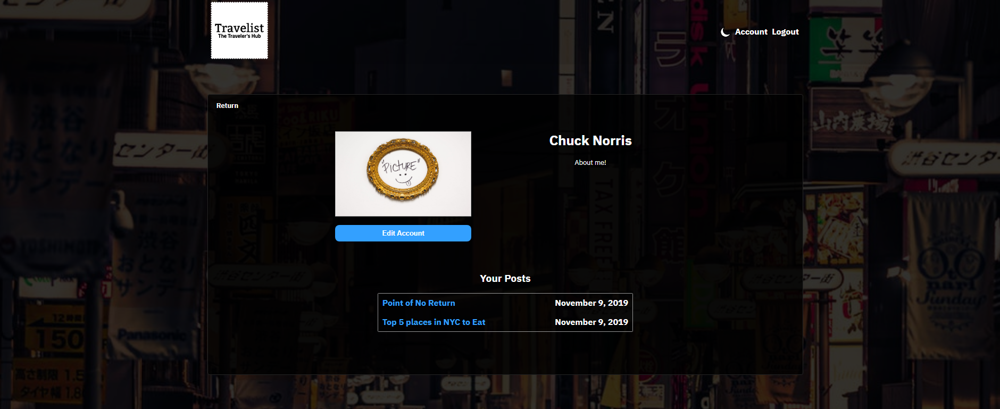
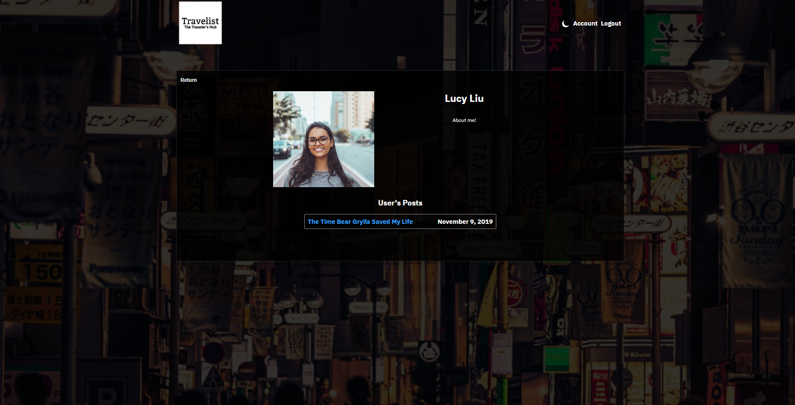
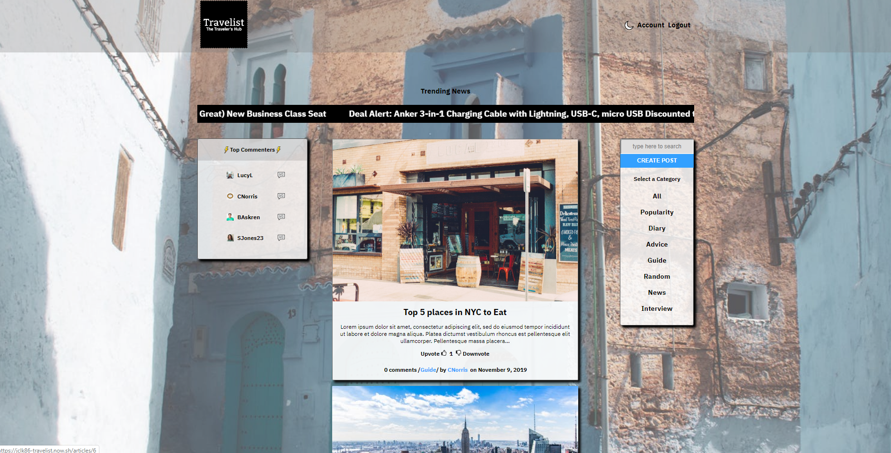

# Travelist

A source for the travel community to create blog articles and to connect with one another.

Live link: https://travelist-client-clfox97sa.vercel.app/

## Login

You may choose to login with the account below or simply create one via registration.

Username: CNorris
Password: Password123!

## Getting Started

This project was bootstrapped with Create React App.

### npm install

There a number of dependencies that need to be installed.

### npm start

Runs the app in the development mode.
Open http://localhost:3000 to view it in the browser.

The page will reload if you make edits.
You will also see any lint errors in the console.

### npm test

This will launch the test runner in the interactive watch mode.

## Motivation

This app was created for travelers who want to share their tips and guides with fellow travel lovers.

## Challenges

From the outset of building any application, organization always poses itself as one of the main challenges. Considering this application involved many components relying on states and that different components required interaction between data and how the data is rendered, it was important to use React's Context feature to prevent excessive prop drilling and create a more centralized source of truth for all the components.

Another challenge dealt with security. With a login feature, it was important that certain CRUD operations on user-owned items are only accessible to the user who is logged in. This solution required the use of JSON Web Tokens, and more specifically, accessing the payload to serve as a an indentifier for the user who is logged in. Individuals working under their account are presented options to edit and delete their own articles and comments. Included in the login feature are services that use APIs to ensure that the site logs out a user due to long inactivity. This solution required constant generating of web tokens with the use of encryption, and the use of session storage to track those valid tokens.

Design was also another aspect of the application that presented its own challenges. Since this application is a travel-themed, it did mean it had to be more visually stimulating. Apart from using background images, a dark and light themed option was implemented. Clicking on the moon icon or the 'light' and 'dark' text toggles the application between day time and night time.

## Screenshots

  
Login:

  

  
Registration:

  

  
Main Article Page:

  

  
Add Article Form:

  

  
Edit Article Form:

  

  
Article:

  

  
Comments:

  

  
User Account:

  

  
Profiles:

  

  
The app's theme can be adjusted from dark to light

  

## Built With

React, Node.js, Express, JavaScript, and PostgreSQL. And Jest, Enzyme, Mocha, and Chai were all utilized in testing.
